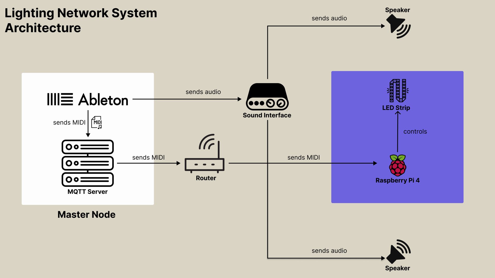

# lighting-network
Lighting Network for Audiovisual System

## System Architecture
A computer (master node) will play audio via Ableton Live and send MIDI notes to a network of LED light strip(s) over WiFi. 
LED lights are controlled by an Arduino / Rasberry Pi controller(s).

## Technical Information
- **Audio Source:**  
Audio is generated by instruments in Ableton using MIDI notes. Audio is transferred to speaker via a sound interface.

- **MIDI Transfer:**  
MIDI note transmission is based on Message Queuing Telemetry Transport (MQTT).  
An MQTT server on the master node listens to Ableton Live for MIDI notes and publishes them.  
A subscriber on the controller receives the MIDIs and use the data to control the lighting.

- **Lighting Network Control:**  
A script is is denoted to control the LED strip. Initial idea is to divide an LED strip by the number of instruments available and assign equal portions of the strip to the instruments.  
Various MIDI information (pitch, after touch ...) are used to control the lighting.

## System Components
- Hardware
    - Master node (computer w macOS / Windows)
    - Speakers
    - Sound Interface (preferrably 2 inputs 2 outputs)
    - Controller (Rasberry Pi 4)
    - [Lighting](https://www.berrybase.de/adafruit-neopixel-led-streifen-starter-pack-30-led/meter-weiss-1m?c=2428)
        - LED Strip (WS2812 RGB)
        - Cable pins (red => power / white => ground / blue => data)
        - Power Source

- Software
    - Ableton Live

- Tech Stack
    - Python
    - [Mosquito](https://mosquitto.org/) (open-source MQTT protocol)

## Milestones
1. Build the end-to-end architecture
    - Hardware Setup
    - Network Setup (Implementation of MQTT based communication)
    - End-to-End Testing (MIDI signal is successfully transmitted and LED is successfully lit up)
2. Implementation LED controlling program
3. Scale up the lighting network (optional)
4. Create report
5. Presentation

## Task Distribution
| Task                                   | Assignee        |
|----------------------------------------|-----------------|
| Build the end-to-end architecture      | Alpar, Bach     |
| Implementation LED controlling program | Alpar, Bach     |
| Scale up the lighting network          | Alpar, Bach     |
| Create report                          | Alpar, Bach     |
| Presentation                           | Alpar, Bach     |
